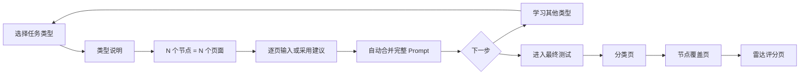

# 六类 Prompt 学习地图

```mermaid
flowchart LR
  A[选择任务类型] --> B[类型说明] --> C[N 个节点 = N 个页面]
  C --> D[逐页输入或采用建议]
  D --> E[自动合并完整 Prompt]
  E --> F{下一步}
  F --> G[学习其他类型]
  F --> H[进入最终测试]
  G --> A
  H --> I[分类页] --> J[节点覆盖页] --> K[雷达评分页]
```
