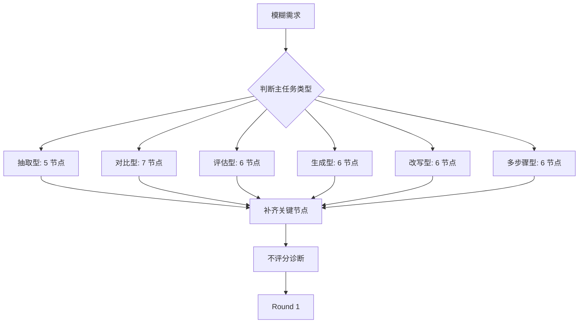

# 课程全图：先选类型，再补节点，最后练习

```mermaid
flowchart TD
  A[模糊需求] --> B{判断主任务类型}
  B --> C[抽取型: 5 节点]
  B --> D[对比型: 7 节点]
  B --> E[评估型: 6 节点]
  B --> F[生成型: 6 节点]
  B --> G[改写型: 6 节点]
  B --> H[多步骤型: 6 节点]
  C --> I[补齐关键节点]
  D --> I
  E --> I
  F --> I
  G --> I
  H --> I
  I --> J[不评分诊断]
  J --> K[Round 1]
```

对比型的 7 个节点：决策问题、对比对象、输入材料、对比维度、使用场景/读者、输出格式、验收标准。

生成型的 6 个节点：要交付什么、已知背景/素材、给谁看、内容要点与边界、格式/语气、验收标准。
